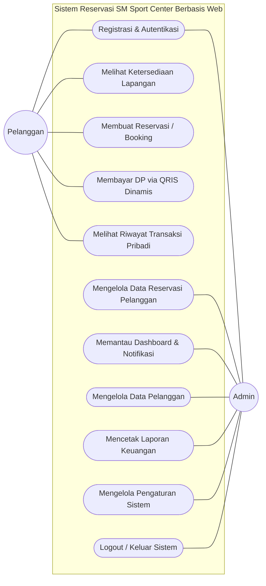

# Dokumen 1: Analisis Skalabilitas Perangkat Lunak

**Mata Uji Kompetensi:** J.620100.002.01 Menganalisis Skalabilitas Perangkat Lunak
**Proyek:** Sistem Reservasi Lapangan Olahraga SM Sport Center

---

## 1. Analisis Kebutuhan dan Identifikasi Aktor

### A. Identifikasi Aktor
Berdasarkan proses bisnis pada SM Sport Center, terdapat dua aktor utama yang berinteraksi dengan sistem:
1. **Pelanggan / Member (User):** Pihak yang menyewa lapangan. Mereka memerlukan antarmuka untuk melihat jadwal kosong, melakukan pemesanan (reservasi), dan melihat riwayat pemesanan mereka sendiri.
2. **Administrator (Admin):** Pihak manajemen SM Sport Center. Bertanggung jawab mengelola data master (harga lapangan), mengawasi seluruh transaksi reservasi, dan memvalidasi atau membatalkan pesanan.

### B. Diagram Use Case (Use Case Diagram)
Diagram berikut memetakan batasan sistem dan interaksi antara aktor dengan fungsionalitas aplikasi:

### C. Kebutuhan Fungsional (Functional Requirements)
1. **Sistem Autentikasi:** Sistem harus Mengadopsi arsitektur Next.js App Router dengan React Server Components (RSC) untuk mempercepat muat awal halaman (TTV) secara signifikan.
2. **Manajemen Reservasi (Pelanggan):** Sistem harus memungkinkan pelanggan memilih tanggal, jam mulai, dan jam selesai, serta memastikan jadwal tersebut belum di-_booking_ oleh orang lain.
3. **Manajemen Reservasi (Admin):** Sistem harus menampilkan seluruh daftar reservasi dalam sebuah Dasbor dan mengizinkan admin untuk mengubah status pesanan (Selesai/Dibatalkan) serta menghapus pesanan (CRUD).
4. **Manajemen Pengaturan (Admin):** Sistem harus memiliki panel pengaturan dinamis bagi Admin untuk memperbarui harga sewa lapangan dan informasi kontak yang tampil pada *Landing Page*.
5. **Validasi Anti-Bentrok:** Sistem secara proaktif menolak masukan jadwal jika terjadi irisan waktu (_time overlap_) pada lapangan dan tanggal yang sama.

### D. Kebutuhan Non-Fungsional (Non-Functional Requirements)
1. **Performa:** Waktu respons (_response time_) untuk mengecek ketersediaan jadwal harus di bawah 1 detik agar pelanggan tidak merasa *lag*.
2. **Ketersediaan (Availability):** Sistem di-_deploy_ di atas layanan *cloud* (Vercel) yang menjamin *uptime* 99.9%.
3. **Keamanan:** Komunikasi data diamankan melalui enkripsi SSL (HTTPS) dan kredensial akses diatur melalui *Role-Based Access Control* (RBAC).

---

## 2. Analisis Skalabilitas Sistem

Sistem reservasi yang bersifat _real-time_ menghadapi tantangan ketika jumlah pengguna (*traffic*) meningkat secara drastis, terutama pada jam-jam *prime time* (sore - malam hari).

### A. Potensi Bottleneck
*Bottleneck* (penyempitan performa) yang paling potensial terjadi pada proses eksekusi **Query Pengecekan Ketersediaan Jadwal**. 
Ketika 100 orang secara bersamaan menekan tombol "Booking" pada tanggal yang sama, _database_ harus melakukan perhitungan matematika (_overlap detection_) pada rentang waktu `jam_mulai` dan `jam_selesai`. Jika tabel reservasi sudah berisi ratusan ribu baris, _Full Table Scan_ akan terjadi dan mengakibatkan antrean proses di CPU _Database_.

### B. Estimasi Pertumbuhan Data
SM Sport Center memiliki **2 lapangan futsal dan 3 lapangan badminton** (Total 5 lapangan).
Asumsi operasional: 
- 1 Lapangan melayani maksimal 10 sesi/hari.
- Total maksimal per hari = 5 lapangan x 10 sesi = 50 reservasi/hari.
- Perkiraan dalam 1 Bulan = 1.500 baris data reservasi.
- **Perkiraan Pertumbuhan Data 1 Tahun = 18.250 baris data / tahun.**

Berdasarkan Arsitektur Saat Ini: Next.js Full-Stack App + Serverless PostgreSQL (Neon DB) + Vercel Deployment menangani 18.250 baris/tahun adalah beban kerja yang sangat ringan (Skala Kecil-Menengah). Skalabilitas *storage* tidak menjadi masalah utama, melainkan skalabilitas kalkulasi *Read-Query*.

### C. Solusi Peningkatan Performa (Telah Diterapkan)

Untuk memastikan sistem berjalan optimal pada skala awal-menengah, beberapa strategi optimasi telah diimplementasikan secara langsung pada level kode dan *database*:

1. **Database Indexing (`CREATE INDEX`)**: Pembuatan indeks pada kolom *foreign key* (`user_id`, `court_id`) dan kolom pencarian (`email`) telah diterapkan guna mempercepat eksekusi *query* dan mencegah *Full Table Scan*.
2. **Sistem DP QRIS Dinamis**: Fitur pembayaran DP 50% diwajibkan di muka untuk mengunci jadwal, hal ini bertujuan meminimalisir risiko pelanggan fiktif (*No-Show*).
3. **Auto-Cancel / Timeout 20 Menit**: Logika pembatalan otomatis (*pseudo-cron*) telah disematkan di dalam sistem. Pesanan yang menggantung lebih dari 20 menit tanpa pelunasan DP akan dibatalkan otomatis untuk membuka kembali ketersediaan slot.

### D. Rekomendasi Skalabilitas Lanjutan (Masa Depan)

Apabila *traffic* mencapai ratusan ribu transaksi harian, berikut rancangan arsitektur lanjutan yang disarankan:

| No | Rekomendasi Peningkatan | Alasan & Manfaat |
|:---|:---|:---|
| 1 | **Gunakan PgBouncer / Neon Pooler** | Menangani lonjakan koneksi (*Connection Pooling*) agar *database* tidak tumbang saat ribuan klien mengakses serentak. |
| 2 | **Caching Layer (Redis)** | Menyimpan hasil *query* ketersediaan lapangan di memori (Redis) untuk menghindari permintaan baca (Read) langsung ke *database* secara berlebihan. |
| 3 | **Server-side Pagination** | Mengoptimalkan pemuatan data di Dasbor Admin dengan membatasi pengambilan data (misal: 50 baris per halaman) menggunakan perintah `LIMIT` & `OFFSET`. |
| 4 | **Rate Limiting di Endpoint API** | Melindungi *server* dengan mencegah aktivitas *spam* atau percobaan *booking* palsu massal yang dilakukan oleh program *bot*. |

## 3. Kesimpulan
Dengan estimasi ukuran basis data kurang dari 5 MB dalam kurun 5 tahun, sistem ini tergolong efisien dan ringan. Kombinasi arsitektur *Next.js Server Actions* (Vercel) dan *Serverless PostgreSQL* (Neon), dipadukan dengan optimasi performa bawaan (Indexing & Auto-Cancel), menjadikan aplikasi ini sangat reliabel (tangguh). Seluruh kasus uji kritis seperti *double booking* telah ditangani secara utuh pada level kode. Adapun rekomendasi tingkat lanjut (Redis & Connection Pooling) murni disiapkan sebagai langkah strategis jangka panjang apabila SM Sport Center berkembang menjadi ekosistem skala masif.
