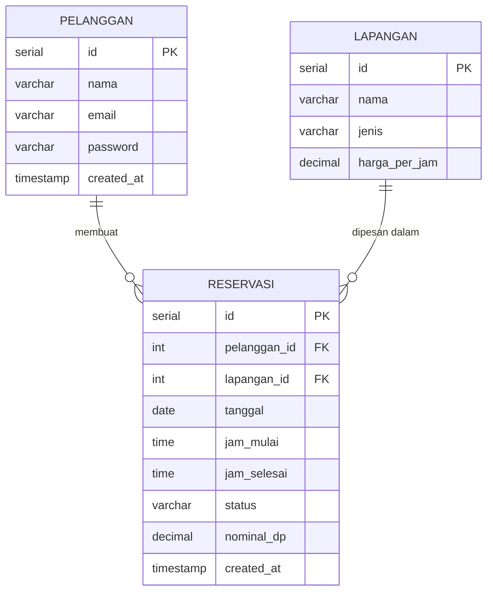

# Dokumen 2: ERD dan SQL Script

**Mata Uji Kompetensi:** 
- J.620100.020.02 Menggunakan SQL
- J.620100.021.02 Menerapkan Akses Basis Data
**Proyek:** Sistem Reservasi Lapangan Olahraga SM Sport Center

---

## 1. Entity Relationship Diagram (ERD)

Desain basis data terdiri dari tiga tabel utama dengan relasi sebagai berikut:
- **Tabel `pelanggan`** memiliki relasi *One-to-Many* (1:N) terhadap tabel `reservasi` (Seorang pelanggan dapat membuat banyak reservasi).
- **Tabel `lapangan`** memiliki relasi *One-to-Many* (1:N) terhadap tabel `reservasi` (Satu lapangan dapat memiliki banyak reservasi).



---

## 2. Implementasi SQL Script

Skrip SQL (_Data Definition Language_ dan _Data Manipulation Language_) yang digunakan untuk merancang skema *database* PostgreSQL melalui koneksi _Cloud_ (Neon DB):

```sql
-- ==========================================
-- DDL: PEMBUATAN TABEL DAN STRUKTUR DATABASE
-- ==========================================

-- 1. Membuat tabel Pelanggan
CREATE TABLE IF NOT EXISTS pelanggan (
  id SERIAL PRIMARY KEY,
  nama VARCHAR(100) NOT NULL,
  email VARCHAR(100) UNIQUE NOT NULL,
  password VARCHAR(255) NOT NULL,
  created_at TIMESTAMP DEFAULT CURRENT_TIMESTAMP
);

-- 2. Membuat tabel Lapangan
CREATE TABLE IF NOT EXISTS lapangan (
  id SERIAL PRIMARY KEY,
  nama VARCHAR(100) NOT NULL,
  jenis VARCHAR(50) NOT NULL, 
  harga_per_jam DECIMAL(10,2) NOT NULL
);

-- 3. Membuat tabel Reservasi
CREATE TABLE IF NOT EXISTS reservasi (
  id SERIAL PRIMARY KEY,
  pelanggan_id INTEGER NOT NULL REFERENCES pelanggan(id) ON DELETE CASCADE,
  lapangan_id INTEGER NOT NULL REFERENCES lapangan(id) ON DELETE CASCADE,
  tanggal DATE NOT NULL,
  jam_mulai TIME NOT NULL,
  jam_selesai TIME NOT NULL,
  status VARCHAR(50) NOT NULL DEFAULT 'Menunggu Pembayaran',
  nominal_dp DECIMAL(10,2) DEFAULT 0,
  created_at TIMESTAMP DEFAULT CURRENT_TIMESTAMP
);

-- ==========================================
-- DML: PENGISIAN DATA AWAL (SEEDING)
-- ==========================================

-- A. Memasukkan data master Lapangan (2 Futsal, 3 Badminton)
INSERT INTO lapangan (nama, jenis, harga_per_jam) VALUES
('Lapangan Futsal 1', 'Futsal', 150000),
('Lapangan Futsal 2', 'Futsal', 150000),
('Lapangan Badminton 1', 'Badminton', 50000),
('Lapangan Badminton 2', 'Badminton', 50000),
('Lapangan Badminton 3', 'Badminton', 50000)
ON CONFLICT DO NOTHING;

-- B. Memasukkan akun Administrator
INSERT INTO pelanggan (nama, email, password) VALUES
('Super Admin', 'admin@smsport.com', 'admin123')
ON CONFLICT (email) DO NOTHING;

-- C. Memasukkan sampel data Pelanggan reguler
INSERT INTO pelanggan (nama, email, password) VALUES
('Surya', 'surya@example.com', 'rahasia123'),
('Budi Santoso', 'budi.santoso@example.com', 'password123')
ON CONFLICT (email) DO NOTHING;
```
